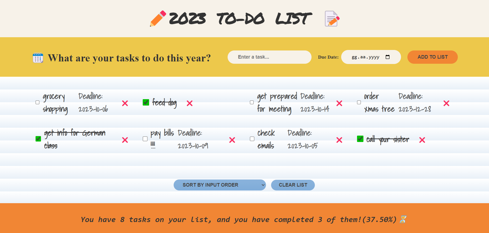

# 📝 To-Do List Made By React

Simple to-do list app made by React components and hooks.

# Built with

- JavaScript, React(v18.2)

# Reach the App

You need to follow these steps to reach the project

1-Clone the repo

2-In the project directory, you can run `npm install`

3-Run `npm start`

You can reach the project here, [todo list](https://berenvrl.github.io/to-doList-React/)

# Visual of the project

